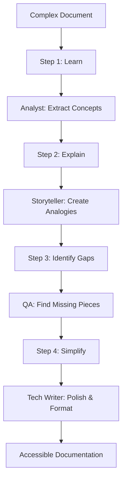

# Feynman Document Processor Skill

This skill implements the Feynman Technique for document processing, creating clear and accessible explanations from complex source materials.

## The Feynman Technique (4 Steps)

### Step 1: Learn
- **Input**: Raw documents (PDFs, text, JSON)
- **Process**: Extract and understand core concepts
- **BMAD Agent**: Analyst (Mary) for domain research and concept identification
- **Output**: Structured concept map

### Step 2: Explain
- **Input**: Concept map from Step 1
- **Process**: Create simple explanations as if teaching a child
- **BMAD Agent**: Storyteller (Sophia) for narrative clarity
- **Output**: Draft explanations with analogies

### Step 3: Identify Gaps
- **Input**: Draft explanations from Step 2
- **Process**: Find knowledge gaps, unclear sections, missing context
- **BMAD Agent**: QA Engineer (Quinn) for systematic gap analysis
- **Output**: Gap analysis report with specific improvement areas

### Step 4: Simplify
- **Input**: Gap analysis + draft explanations
- **Process**: Refine explanations, add visual aids, ensure accessibility
- **BMAD Agent**: Tech Writer (Paige) for final documentation polish
- **Output**: Polished, accessible documentation

## Integration with Existing Pipeline

### Dictionary Processing
```bash
# Enhanced dictionary injection with Feynman explanations
python3 _agents/skills/feynman_document_processor/scripts/feynman_dictionary.py \
  --input historical/staged/staged_casalis_a.json \
  --output data/lexicon_with_explanations.json \
  --bmad-agents "analyst,storyteller,qa,tech-writer"
```

### PDF Processing
```bash
# Historical PDF extraction with Feynman clarity
python3 _agents/skills/feynman_document_processor/scripts/feynman_pdf.py \
  --pdf sources/pdfs/Mabille_Adolphe_Sesuto_English_Dictionary.pdf \
  --pages 1-10 \
  --output reports/mabille_feynman_analysis.md
```

## Output Formats

### 1. Concept Cards
```markdown
## Concept: Morphological Derivation

**Simple Explanation**: Like building with word LEGO blocks 🧱
- Root word = foundation block
- Prefixes = blocks you add to the front  
- Suffixes = blocks you add to the end
- Each block changes the meaning

**Example**: "unhappiness"
- un- (not) + happy (feeling good) + -ness (makes it a thing)
- = "the state of not feeling good"

**Why This Matters**: Understanding word parts helps you figure out new words without a dictionary.
```

### 2. Progressive Explanations
```markdown
## Understanding Sesotho Noun Classes

**Level 1 (Child)**: Sesotho sorts words into groups, like sorting toys into boxes.

**Level 2 (Student)**: Sesotho has 18 noun classes that determine how words behave in sentences.

**Level 3 (Scholar)**: The Bantu noun class system in Sesotho uses prefixes to encode semantic and grammatical information, affecting agreement patterns across the sentence.
```

### 3. Visual Concept Maps


## Best Practices

1. **Start Simple**: Always begin with the simplest possible explanation
2. **Use Analogies**: Connect new concepts to familiar experiences
3. **Test Understanding**: Can a 12-year-old follow your explanation?
4. **Iterate**: Each BMAD agent pass should improve clarity
5. **Visual Aids**: Include diagrams, examples, and structured layouts
6. **Multiple Levels**: Provide explanations at different complexity levels

## Integration Points

- **Input**: Works with existing OCR pipeline outputs
- **Processing**: Leverages BMAD agents for specialized review
- **Output**: Generates multiple formats (markdown, JSON, HTML)
- **Validation**: Integrates with existing schema validation
- **Storage**: Adds explanations to existing lexicon structure